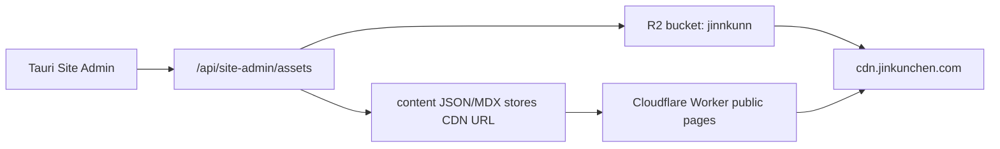

# Media Assets on R2

## Decision

User-managed media should not be committed into the website source tree or
bundled into the Cloudflare Worker build. Use R2 as the canonical media store
and serve production media from `https://cdn.jinkunchen.com`.

Keep small, stable application assets in `public/` only when they are part of
the shell itself, such as favicon files, very small UI icons, and compatibility
CSS assets that must ship with a release.

## Current State

The public bundle currently contains mixed asset classes:

- `public/notion-assets/*.png` is about 2.5 MB and is referenced by:
  - `content/home.json`
  - `content/pages/bio.mdx`
- `public/assets/profile.png`, `public/assets/logo.png`, and
  `public/assets/favicon.png` are small compatibility assets used by the
  classic public site, metadata, and favicon routes.
- `public/web_image/*.svg` contains small link/profile icons and seal assets
  used by the classic Notion-style pages.
- Blog post figures already mostly use `https://cdn.jinkunchen.com/blog/...`.
- Site Admin uploads write to the `SITE_ASSETS` R2 binding when running on
  Cloudflare and return `https://cdn.jinkunchen.com/uploads/...` URLs.
- Local development and tests fall back to the GitHub-compatible content store
  under `public/uploads/<yyyy>/<mm>/<hash>.<ext>`.
- `wrangler.toml` binds `SITE_ASSETS` to the existing `jinnkunn` bucket for
  both staging and production.

The older media bucket/domain is:

- R2 bucket: `jinnkunn`
- Public custom domain: `https://cdn.jinkunchen.com`

Observed on 2026-04-25:

- The `jinnkunn` bucket exists and contains 68 objects / 27.5 MB.
- `cdn.jinkunchen.com` is connected to the bucket, enabled, and has active
  ownership/TLS status.
- Public `r2.dev` access is disabled.
- Existing blog media such as
  `https://cdn.jinkunchen.com/blog/1/axiom_comparison.png` returns `200`.
- Migrated Notion assets under
  `https://cdn.jinkunchen.com/notion-assets/...` return `200` and include
  `cache-control: public, max-age=31536000, immutable`.
- The current response header showed `cf-cache-status: DYNAMIC`, so add a
  cache rule before relying on CDN edge caching for all media objects.

## Target Architecture

Use content JSON/MDX as source of truth for text and references, but keep media
bytes out of Git:

Recommended URL shape:

- `https://cdn.jinkunchen.com/uploads/<yyyy>/<mm>/<sha256>.<ext>` for Site
  Admin uploads.
- `https://cdn.jinkunchen.com/notion-assets/<stable-id>.<ext>` for migrated
  Notion assets.
- `https://cdn.jinkunchen.com/blog/<post-id>/<filename>` for blog figures.

Use immutable object names based on a content hash whenever possible. This
lets the CDN cache aggressively without needing purges for normal updates.

## Why R2 Is Better Here

- Media updates should not require a website rebuild or deployment.
- Worker bundles stay smaller and deploy faster.
- Public page requests avoid unnecessary Worker CPU on media delivery.
- The existing `cdn.jinkunchen.com` custom domain can use Cloudflare cache in
  front of R2.
- R2 has no internet egress charge, so direct media delivery is a good fit for
  public images and downloadable assets.

## Migration Plan

1. Confirm the old `jinnkunn` bucket is still connected to
   `cdn.jinkunchen.com` and that `r2.dev` public access is disabled for
   production.
2. Add explicit media configuration:
   - `MEDIA_BUCKET=jinnkunn`
   - `MEDIA_PUBLIC_BASE_URL=https://cdn.jinkunchen.com`
   - local/S3-compatible credentials for migration scripts
   - Worker binding or S3 API credentials for authenticated Site Admin uploads
3. Add a Cloudflare cache rule for `cdn.jinkunchen.com/*`:
   - cache eligible media by default
   - use long browser/edge TTLs for content-hash URLs
   - keep purge paths available for any legacy mutable URLs
4. Keep the current local assets for one release as a compatibility fallback,
   then remove migrated user media from `public/`.
5. Add a migration script for any future local media that appears under
   `public/notion-assets/*` or `public/uploads/*`.
6. Update smoke checks:
   - asset upload returns `https://cdn.jinkunchen.com/uploads/...`
   - content validators allow the CDN host
   - staging authenticated QA verifies the homepage and bio images load

## Do Not

- Do not route public media through the Worker unless authentication or
  transformation is required.
- Do not store new Site Admin uploads under `public/uploads` after the R2
  backend lands.
- Do not make `r2.dev` the production URL. Use the custom domain.
- Do not overwrite mutable CDN object paths for edited images; write a new
  content-hash object and update the content reference.

## References

- Cloudflare R2 public buckets and custom domains:
  `https://developers.cloudflare.com/r2/data-access/public-buckets/`
- Cloudflare R2 pricing and egress model:
  `https://developers.cloudflare.com/r2/pricing/`
- Cloudflare R2 overview:
  `https://developers.cloudflare.com/r2/`
